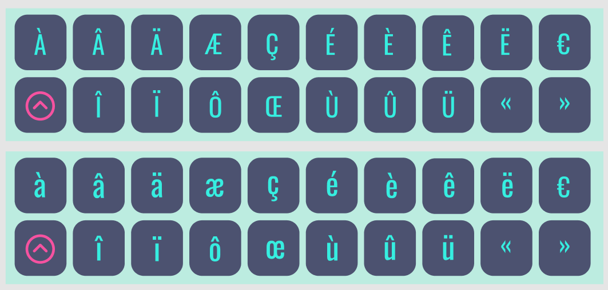

# French Accents ⌨️

A chrome extension that lets you copy French accents, without the need to switch to Azerty.

## Credits and resources 🎨
- [Accented Characters and Ligatures in HTML and JavaScript](http://www.javascripter.net/faq/accentedcharacters.htm)
- [Nunito - Google Fonts](https://fonts.google.com/specimen/Nunito)
- [Clipboard.writeText() - MDN Web Docs](https://developer.mozilla.org/en-US/docs/Web/API/Clipboard/writeText)
- [Getting Started - Google Developers - Extensions](https://developer.chrome.com/docs/extensions/mv3/getstarted/)
- [Shift icon from IconPark by Bytedance](https://iconpark.oceanengine.com/official)

## Link to Extension 🔗
👉 [Link to extension on Chrome Webstore](https://chrome.google.com/webstore/detail/french-accents/jmnjcglbcleaddocnpkckjmlloeaaaak/) 👈

## Link to extension's Figma file ✒️
👉 [Link to file on Figma Community](https://www.figma.com/community/file/1090739194841563580/French-Accents-Chrome-Extension) 👈

## To do ⚡
- Add a color palette change in the extension's option so that user can choose their own theme (including dark theming).
- Make all letters switch to capital case whenever user is holding the Shift key.

## Contributing 🚀
Feel free to submit an issue for bugs and features.

## Screenshot of the Extension 🖼

  

<!-- ## 🎖 Contributors

 -->
